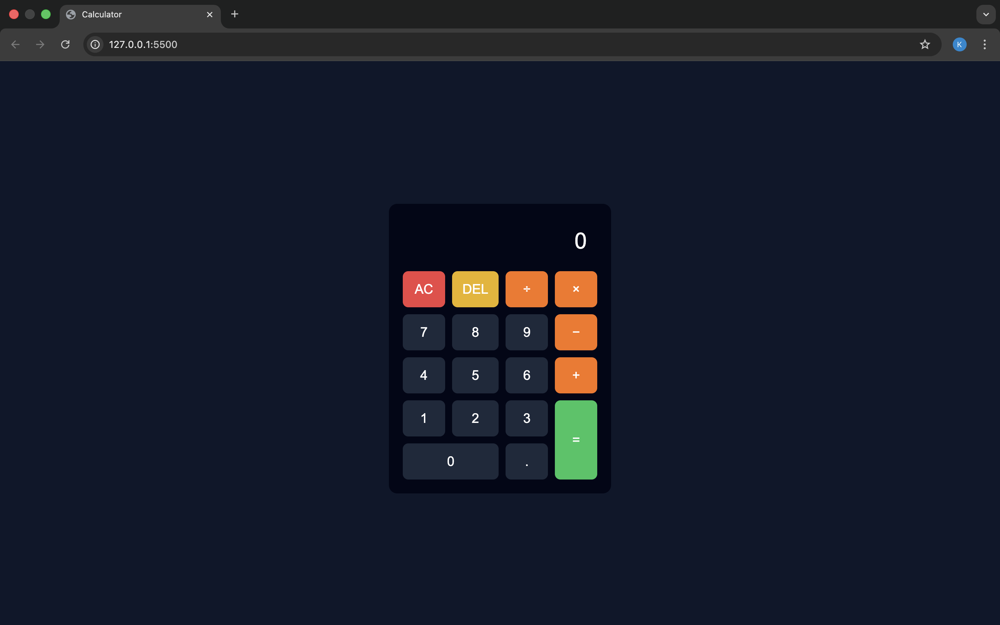

# 🧮 Calculator App

A simple and modern **Calculator Web Application** built using **HTML, CSS, and JavaScript**.
This project performs basic arithmetic operations with a clean and responsive UI.

---

## 🚀 Live Demo
🔗 https://kavita635.github.io/calculator-js/

---

## 📌 Features
- Addition, Subtraction, Multiplication, Division
- Clear (AC) and Delete (DEL) functionality
- Decimal support
- Error handling (division by zero)
- Responsive and modern UI
- Built using pure JavaScript (no libraries)

---

## 🛠️ Technologies Used
- **HTML5** – Structure
- **CSS3** – Styling (Grid Layout)
- **JavaScript (ES6)** – Logic & DOM Manipulation

---

## 📁 Project Structure
calculator-js/
│
├── index.html
├── style.css
├── script.js
└── README.md

## 📷 Screenshot


## 🎯 Learning Outcomes
- Hands-on practice with JavaScript DOM manipulation
- Understanding event handling
- Working with CSS Grid layouts
- Building real-world frontend projects

---

## 📌 How to Run Locally
1. Clone the repository:
   ```bash
   git clone https://github.com/Kavita635/calculator-js.git

